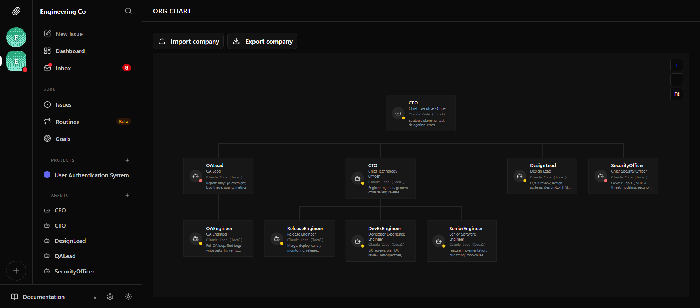

# paperclip-gstack-company

An autonomous AI engineering team that plans, codes, reviews, ships, and monitors production — built by combining two open-source systems: **[Paperclip](https://github.com/paperclipai/paperclip)** (multi-agent orchestration) and **[gstack](https://github.com/garrytan/gstack)** (engineering skill library).

---

## What This Is

This repository demonstrates three things:

### 1. Seamless Integration of Paperclip + gstack

[Paperclip](https://github.com/paperclipai/paperclip) and [gstack](https://github.com/garrytan/gstack) were built independently. This project wires them together into a working 9-agent engineering team with zero modifications to either upstream codebase.

**Paperclip** provides the org chart: a company with named agents, roles, heartbeat schedules, an issue tracker, approval workflows, budget tracking, and a REST API. Each agent is a Claude Code subprocess that wakes on a cron schedule or when a task is assigned to it.

**gstack** provides the skills: 26 battle-tested, role-specific engineering workflows — code review, security audit, QA, deployment, planning, and more — each encoded as a structured `SKILL.md` prompt that guides an agent through a complex multi-step task.

The integration requires no adapter changes. Paperclip's `claude_local` adapter mounts skills via `--add-dir`, the same mechanism gstack uses. A single bridge skill (`gstack-bridge`) teaches agents how to operate gstack's interactive workflows inside Paperclip's headless, async environment.

```
Human (Board Operator)
└── CEO              ← /autoplan, /plan-ceo-review, /office-hours
    ├── CTO          ← /plan-eng-review, /review, /ship
    │   ├── SeniorEngineer   ← /investigate, /codex
    │   ├── ReleaseEngineer  ← /land-and-deploy, /canary, /document-release
    │   └── DevExEngineer    ← /devex-review, /benchmark, /retro
    ├── QALead        ← /qa-only
    │   └── QAEngineer       ← /qa
    ├── SecurityOfficer      ← /cso, /careful, /guard
    └── DesignLead    ← /design-review, /design-html, /design-consultation
```



When a human creates a task and assigns it to the CEO, the full delegation cascade runs autonomously: CEO breaks it down and delegates to its reports, each report wakes automatically on assignment, does its work, creates sub-tasks for its own reports, and so on — all coordinated through the Paperclip REST API using `curl`, with no inter-agent messaging frameworks required.

**Verified in the [end-to-end test](docs/end-to-end-test-report.md):** a single task ("Implement user authentication with email/password login") cascaded through 5 agents and produced 6 issues across 2 delegation levels — all automatically, in under 10 minutes, at a total cost of $0.43.

---

### 2. Automated E2E Testing with chrome-devtools MCP + claude-in-chrome

The entire system was tested and verified without leaving Claude Code, using two browser automation tool sets:

- **`mcp__chrome-devtools__*`** — Chrome DevTools Protocol tools for navigation, accessibility tree reading, element clicking, and screenshot capture
- **`mcp__claude-in-chrome__*`** — Extension-based tools for higher-level page interaction and GIF recording

The testing approach:
- Navigate Paperclip's web UI programmatically to observe live agent runs
- Read agent run logs to verify tools used (confirming agents used `curl`, not banned tools like `TeamCreate`)
- Inspect issue pages to verify delegation chains (correct parent/child relationships, correct assignees)
- Capture a **74-screenshot archive** of every page in the UI as evidence

The core interaction pattern — `take_snapshot` → read accessibility tree → `click uid` — allows reliable interaction with dynamic, React-rendered UI without CSS selectors or XPath. See the full guide:

📄 **[docs/guides/e2e-testing-with-browser-automation.md](docs/guides/e2e-testing-with-browser-automation.md)**

This guide is the most detailed public documentation of using `chrome-devtools` MCP and `claude-in-chrome` for end-to-end testing of a complex web application.

---

### 3. Comprehensive Documentation

Every aspect of the system is documented — from zero-to-running in 15 minutes, to deep architectural decisions:

| Category | Documents |
|----------|-----------|
| **Getting started** | [Prerequisites](docs/getting-started/prerequisites.md) · [Quickstart](docs/getting-started/quickstart.md) · [Onboarding](docs/getting-started/onboarding.md) |
| **Concepts** | [gstack Skills](docs/concepts/gstack-skills.md) · [Paperclip Platform](docs/concepts/paperclip-platform.md) · [Bridge Skill](docs/concepts/bridge-skill.md) · [Engineering Company](docs/concepts/engineering-company.md) |
| **Guides** | [Provision the Company](docs/guides/provision-engineering-company.md) · [Create Tasks](docs/guides/create-and-assign-tasks.md) · [Handle Approvals](docs/guides/handle-approvals.md) · [Add an Agent](docs/guides/add-a-new-agent.md) · [Add a Skill](docs/guides/add-a-custom-skill.md) · [E2E Browser Testing](docs/guides/e2e-testing-with-browser-automation.md) |
| **Reference** | [company.json](docs/reference/company-json.md) · [Bridge Skill API](docs/reference/bridge-skill-api.md) · [Checkpoint Map](docs/reference/checkpoint-map.md) · [Environment Variables](docs/reference/environment-variables.md) |
| **Architecture** | [System Design](docs/architecture/system-design.md) · [ADR 001: Bridge Skill](docs/architecture/adr/001-bridge-skill-not-adapter-patch.md) · [ADR 002: Multi-Agent](docs/architecture/adr/002-multi-agent-not-single-agent.md) |
| **Test results** | [End-to-End Test Report](docs/end-to-end-test-report.md) |
| **Troubleshooting** | [Common Issues](docs/troubleshooting/common-issues.md) |

---

## Quick Start

```bash
# 1. Clone
git clone https://github.com/az9713/paperclip-gstack-company.git
cd paperclip-gstack-company

# 2. Install and start Paperclip
cd paperclip && pnpm install && pnpm dev:server

# 3. Provision the 9-agent engineering team
cd ../companies/engineering && ./setup.sh

# 4. Create your first task
curl -X POST http://localhost:3100/api/companies/<COMPANY_ID>/issues \
  -H "Content-Type: application/json" \
  -d '{"title": "Add a /health endpoint", "assigneeAgentId": "<CEO_ID>"}'

# 5. Watch it work at http://localhost:3100
```

Full instructions: [docs/getting-started/quickstart.md](docs/getting-started/quickstart.md)

> **If you have Claude Code plugins installed** (check with `claude plugins list`), follow [Step 5b](docs/getting-started/quickstart.md#step-5b--isolate-agent-claude-config-required-if-you-have-claude-code-plugins) to isolate agent config — otherwise plugins will hijack agent runs.

---

## Repository Structure

```
paperclip-gstack-company/
├── gstack/                          # gstack skill library (upstream, unmodified)
│   ├── review/                      # /review skill
│   ├── ship/                        # /ship skill
│   ├── qa/                          # /qa skill
│   └── ...                          # 26 skills total
│
├── paperclip/                       # Paperclip server (upstream, unmodified)
│   ├── packages/
│   │   ├── server/                  # REST API + scheduler
│   │   ├── ui/                      # React web interface
│   │   └── adapters/claude-local/   # Claude Code subprocess adapter
│   └── ...
│
├── companies/
│   └── engineering/                 # Engineering Company template
│       ├── company.json             # 9-agent definitions, org chart, skill assignments
│       ├── setup.sh                 # Provision script: imports skills, creates agents
│       ├── skills/
│       │   └── gstack-bridge/       # Bridge skill: adapts gstack for Paperclip headless mode
│       │       ├── SKILL.md         # Core bridge protocol (checkpoints, approvals, delegation)
│       │       └── CLAUDE.md        # Banned tools enforcement
│       └── onboarding/              # Per-role instruction bundles
│           ├── ceo/AGENTS.md        # CEO delegation rules, banned tools, curl protocol
│           ├── cto/AGENTS.md
│           └── ...                  # One AGENTS.md per role
│
└── docs/                            # Full documentation (25 documents)
    ├── index.md                     # Documentation index
    ├── end-to-end-test-report.md    # Test results: 5 agents, 6 issues, $0.43
    └── guides/
        └── e2e-testing-with-browser-automation.md  # chrome-devtools + claude-in-chrome guide
```

---

## Key Design Decisions

**Why a bridge skill and not an adapter patch?**
Keeping the integration in a prompt-layer skill means neither Paperclip nor gstack needs to know the other exists. The bridge is a thin translation layer: it teaches agents to substitute `AskUserQuestion` with Paperclip approvals, and inline skill chains with async subtask delegation. See [ADR 001](docs/architecture/adr/001-bridge-skill-not-adapter-patch.md).

**Why 9 separate agents and not one agent with all skills?**
Role separation gives each agent a focused context window, appropriate skill set, and heartbeat schedule. A single "super-agent" with 26 skills would have a bloated context and no clear escalation path for human oversight. See [ADR 002](docs/architecture/adr/002-multi-agent-not-single-agent.md).

**Why `claude-haiku-4-5-20251001` and not a stronger model?**
End-to-end testing showed that `claude-haiku-4-5-20251001` follows multi-step Paperclip protocol reliably at low cost. The earlier `claude-3-haiku-20240307` (Haiku 3) was insufficient — it ignored AGENTS.md and fell back to banned tools regardless of how explicit the instructions were. Model capability matters more than prompt engineering for headless agents.

---

## What Was Tested

The [end-to-end test report](docs/end-to-end-test-report.md) documents a complete run of the system:

- **Task:** "Implement user authentication with email/password login" (ENGA-1)
- **Result:** 5 of 9 agents ran autonomously, creating a 2-level delegation tree:
  ```
  ENGA-1  CEO → SeniorEngineer          [in_progress]
  ├── ENGA-2  CEO → CTO                 [done]
  │   ├── ENGA-5  CTO → SecurityOfficer [todo]
  │   └── ENGA-6  CTO → QAEngineer      [todo — QA run completed]
  ├── ENGA-3  CEO → SecurityOfficer     [todo]
  └── ENGA-4  CEO → QALead              [todo]
  ```
- **Cost:** $0.43 for the full cascade
- **Human intervention:** Zero after initial task creation
- **Verified by:** 74 browser screenshots + agent run log inspection via chrome-devtools MCP

Three non-obvious infrastructure issues were discovered and fixed during testing — all documented in the test report and [Common Issues](docs/troubleshooting/common-issues.md).

---

## Prerequisites

- Node.js 20+, pnpm 9+, Bun
- Claude Code CLI (`npm install -g @anthropic-ai/claude-code`)
- Anthropic API key
- `jq` (for setup.sh)
- Git

See [docs/getting-started/prerequisites.md](docs/getting-started/prerequisites.md) for exact versions and installation instructions.

---

## License

MIT
